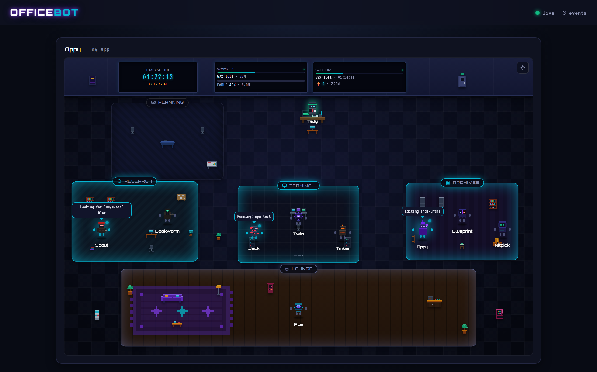
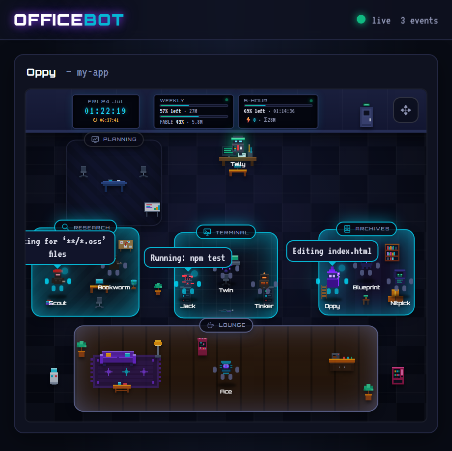

# officebot

**A live pixel-art "office" for your Claude Code sessions.** Every session
becomes an office floor with a full cast of characters: the boss (your model)
delegates, the crew works the rooms, everyone banters — and it's all driven by
real events. It's a fun, glanceable window into what Claude Code is doing.

Zero dependencies. Runs entirely on your machine. **Nothing is ever sent
anywhere** — it just reads your local Claude Code logs and serves a page on
`localhost`.



*A live moment: Scout searching in Research, Jack running tests in Terminal,
the boss editing in Archives — real tool calls, real speech bubbles, while the
rest of the crew holds down their rooms.*

---

## Meet the office

**The boss is whichever Claude model is running your session**, each with a
persona and an office rank: **Fabby** the Director (Fable), **Oppy** the
Manager (Opus), **Sonny** the Lead (Sonnet), **Kiku** the scrappy Senior
Staffer (Haiku). Switch models (`/model`) and the outgoing boss hands the desk
over — walks out while the new one walks in — with the crew commenting on the
new management (Haiku gets roasted; nobody escapes the workers' banter).

**The crew are your agent types**, each with a name, a face, a profession and
a home room:

| | Agent type | Role | Home |
|---|---|---|---|
| **Scout** | `Explore` | recon & exploration | Research |
| **Bookworm** | `claude-code-guide` | docs & knowledge | Research |
| **Jack** | `general-purpose` | the handyman | Lounge |
| **Ace** | `claude` | the wildcard | Lounge |
| **Blueprint** | `Plan` | planner / architect | Archives |
| **Nitpick** | `code-reviewer` | code review / QA | Archives |
| **Twin** | `fork` | parallel worker | Terminal |
| **Tinker** | `statusline-setup` | tooling & config | Terminal |

When the boss delegates to one of these types, that crew member leaves their
spot and *works the job* — then walks back when it's done. Even Claude Code's
internal background tasks get picked up by whoever's profession fits closest.
Custom agent types get their own generated codenames.

**And the office lives on its own:** the crew wanders between rooms, whoever
shares a room strikes up profession-flavoured conversations (with the
occasional shout across the floor), turns that finish cleanly get confetti,
failures get a red "!", hand-backs get a ✓ and sometimes a spoken review from
the boss. **Hover (or tap) any character for their bio.** Tally the accountant
mans the wall meters — the live clock, your 5-hour window and weekly usage —
and pipes up only when the burn actually climbs. When a limit is truly spent,
the whole office clocks out one by one… and drifts back in when it resets.

---

## Quick start

You need [Node.js](https://nodejs.org) (v16+), which you already have if you use
Claude Code. Then, in a terminal:

```bash
npx @cybermu22/officebot setup
```

That's it. This one command:

1. **Wires Claude Code to the dashboard** — it adds a small set of "hooks" to
   your `~/.claude/settings.json` (safely: it backs the file up first and never
   touches anything else you have in there).
2. **Starts the dashboard** and opens it in your browser at
   **http://localhost:4317**.

Now open a Claude Code session anywhere and watch it appear. Leave the
`officebot` window running in the background; press `Ctrl+C` to stop it.

> Already ran `setup` once? You don't need it again — just run
> `npx @cybermu22/officebot` to start the dashboard any time.

---

## Commands

| Command | What it does |
|---|---|
| `npx @cybermu22/officebot setup` | Wire up Claude Code, then start the dashboard |
| `npx @cybermu22/officebot` | Just start the dashboard (same as `start`) |
| `npx @cybermu22/officebot demo` | Start it **and** play a fake session, so you can see it work without a real one |
| `npx @cybermu22/officebot remove` | Cleanly remove the hooks it added (only removes its own) |

**Options:** `--port <n>` (default `4317`), `--no-open` (don't launch a
browser), `-y` (skip prompts). If you pick a custom port at `setup`, use the
same `--port` when you `start`.

---

## Viewing from other devices (phone, another computer, anywhere)



officebot **must run on the same machine as Claude Code** — it reads Claude
Code's local logs and receives its local hooks, so the server can't live on a
separate box. But the dashboard is a normal web page (and a PWA), so you can
*view* it from anywhere. The server already listens on all network interfaces —
you just open the machine's address instead of `localhost`.

**On the same Wi-Fi (phone, laptop):**

1. Find the host computer's local IP (e.g. `192.168.1.42`).
2. On the other device's browser, open `http://<that-ip>:4317`.
3. On a phone, use **"Add to Home Screen"** to keep it one tap away (it's a PWA).

If it won't load, allow port `4317` (or your chosen port) through the host's
firewall.

**From anywhere (outside your network):** ⚠️ officebot has **no login**, so
don't forward the port straight to the public internet — anyone with the URL
could see your dashboard. Use a private tunnel instead:

- **[Tailscale](https://tailscale.com)** (recommended, free) — a private mesh
  VPN. Install it on the host machine and on whatever device you want to watch
  from, then open `http://<host's-tailscale-IP>:4317` (a `100.x.y.z` address).
  Encrypted, no port-forwarding, nothing exposed publicly.
- **[Cloudflare Tunnel](https://developers.cloudflare.com/cloudflare-one/connections/connect-networks/)**
  (free) — if you want a real `https://…` URL:
  `cloudflared tunnel --url http://localhost:4317`. Treat the URL as a secret,
  or put [Cloudflare Access](https://developers.cloudflare.com/cloudflare-one/policies/access/)
  in front of it for a login.

**Custom port:** `npx @cybermu22/officebot start --port 8080` (or set
`AGENT_VIZ_PORT`). If you change it, re-run `setup --port 8080` so the hooks
point at the right place.

**Keep it always-on:** the `start` command runs in a terminal window. To have
it run in the background permanently, launch it as a service — Windows Task
Scheduler / Startup, Linux `systemd`, macOS `launchd`, or a small Docker
container.

---

## Privacy

- Everything runs locally. The server listens on your own machine and reads
  Claude Code's own log files under `~/.claude/projects`.
- **No data leaves your computer.** There is no account, no telemetry, no cloud.
- The usage numbers are honest token counts from your local logs — they're a
  personal gauge, **not** an official Anthropic quota meter (real plan limits
  aren't exposed locally). You can anchor the weekly/5-hour gauges to your real
  account numbers if you want them exact.

---

## How it works

Claude Code can fire **hooks** on session/tool events. `setup` points nine of
them (`SessionStart`, `PreToolUse`, `SubagentStop`, `SessionEnd`, …) at a tiny
local server (`server.js`, plain Node). That server keeps the last event per
session, streams everything to the browser over Server-Sent Events, and reads
the local transcripts to show the active model, live token usage, and what
Claude just "said". The browser page (`public/`) renders it all as the animated
office — just HTML/CSS/SVG + one script, no framework, no build step.

For the full architecture and design notes, see
[ARCHITECTURE.md](ARCHITECTURE.md).

---

## Uninstall

```bash
npx @cybermu22/officebot remove   # takes the hooks back out of settings.json
```

Then stop the server (close its window). `npx` copies are cleaned up
automatically.

---

## Optional: home-screen image widget

For Android *image* widgets (KWGT etc.) that can't run a live web page, there's
a PNG snapshotter (`snapshot.js`). It's **optional** and needs Playwright:

```bash
npm i -g playwright && npx playwright install chromium
```

Most people don't need it — the PWA above is the simpler path.

---

## Development

```bash
git clone <your-repo-url>
cd officebot
node cli.js demo      # run it with a fake session
```

No build step, no dependencies. `server.js` is the backend, `public/index.html`
is the whole frontend, `public/avatars.js` holds the pixel-art roster.

## License

MIT © Mumudrummer
