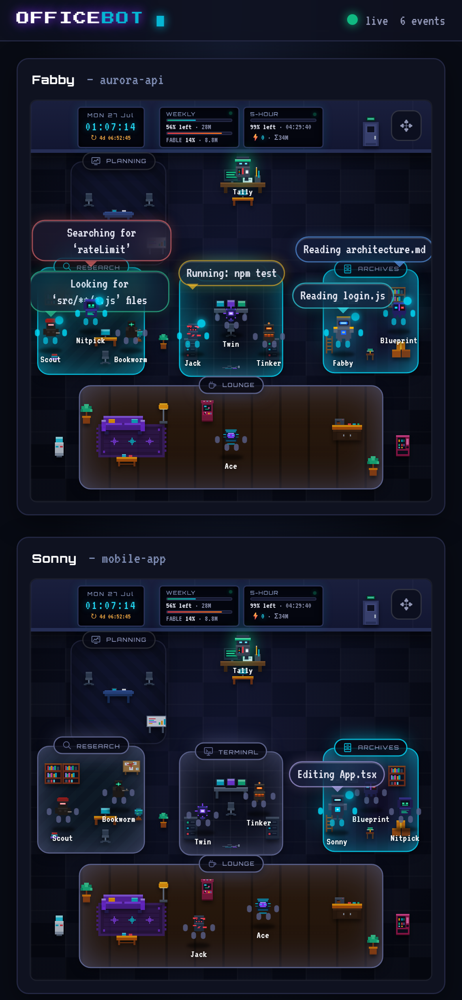

# officebot

### A tiny pixel office where your AI actually goes to work. 🏢

Claude Code normally talks to you in a wall of scrolling text. officebot turns
that into a neon office floor with a little staff in it. Your model is the boss.
Your agents are employees with faces, desks and opinions. When Claude greps
something, a pixel guy gets up and walks to the Research room to do it.

Nothing here is faked or simulated. Every step, every speech bubble, every
coffee break is a real Claude Code event.

⚡ **Zero dependencies** · 🔒 **Never leaves your machine** · 📱 **Also runs on your phone**


> *Two sessions running at once. **Fabby** (Fable) directs `aurora-api` while
> **Sonny** (Sonnet) runs `mobile-app`. Scout is grepping, Jack has the tests
> going, Blueprint is nose-deep in the architecture doc.*

---

## Try it in about ten seconds

You already have Node if you have Claude Code. So:

```bash
npx @cybermu22/officebot setup
```

Your browser opens at **localhost:4317**. Start a Claude Code session anywhere
on the machine and watch someone walk in and get to work.

Want to see it move before wiring anything up? `npx @cybermu22/officebot demo`
plays a fake session — full staff, no setup, nothing touched.

*Latest release: **v1.0.17**.*

---

## What you're actually looking at

The floor has rooms, and the rooms mean something. Research, Terminal, Archives,
Planning, a Lounge with a sofa nobody earned. Everyone has a desk they belong
at. Hand a job to an agent and they stand up, cross the floor to the right room,
and work it — then wander back when they're done.

Speech bubbles carry the real thing they're doing. *Searching for `rateLimit`.*
*Running: npm test.* *Reading login.js.* Colour tells you how much to care, and
every line also drops into the Dialogue feed underneath, so nothing scrolls
past while you blinked.

Between jobs they don't just stand there. Idle staff drift, bump into whoever
shares their room, and start talking rubbish at each other — in character, and
never the same line twice in a row.

Small ceremonies for everything. A clean finish gets confetti. A failed tool
flashes an angry red **!**. Finished work gets handed back with a ✓ and
sometimes a review from the boss. And every prompt you type is physically
carried across the floor to the boss's desk by a courier with a satchel.

Two projects on the go? Two offices, side by side. On a phone they stack.

When you genuinely run out of tokens, the whole place clocks out one at a time,
grumbling on the way past — and drifts back in when your window resets.

---

## The staff


> *Full crew, one floor: Fabby handing out the hard one from Planning, Scout and
> Nitpick buried in Research, Jack and Twin and Tinker on the terminals,
> Blueprint and Bookworm in the Archives, Ace strolling in from the Lounge.*

### Management is whoever you're paying for

Whichever model is driving your session runs the floor, and the office treats it
accordingly. Switch model mid-session with `/model` and you get a proper shift
change: the old boss walks out, the new one walks in, and the crew has thoughts
about the new management.

| | Model | Rank | |
|---|---|---|---|
| **Fabby** | Fable | Director | Top of the org chart. Runs the place with total unbothered authority. |
| **Oppy** | Opus | Manager | The heavyweight in the corner office. Takes the deep work and the hard calls. |
| **Sonny** | Sonnet | Lead | Dependable, fast, still gets hands dirty. Calls the shots without the swagger. |
| **Kiku** | Haiku | Senior Staff | The scrappy fun-size veteran covering the lead chair. Cheap, quick, relentlessly roasted, still ships. Nobody calls Kiku "boss" — they're colleagues. |

### The crew — one per agent type

Delegate to an agent type and that character gets up and does it. Custom agent
types you've invented get their own generated codename and join the floor.

**Scout** · `Explore` · *Research*
First out the door to map a codebase. Greps, globs, reports back. Reads first,
asks never. If it exists in your repo, Scout already found it.

**Bookworm** · `claude-code-guide` · *Research*
The librarian. Knows the manuals, the RFCs and the footnotes. If there's a
documented way to do it, Bookworm found it — page 12.

**Jack** · `general-purpose` · *Lounge*
The handyman. Any odd job, armed with duct tape, belief, and a working knowledge
of a bit of everything.

**Ace** · `claude` · *Lounge*
The wildcard. Deployable for anything, with style. The asterisk in the roster.

**Blueprint** · `Plan` · *Archives*
The architect. Won't let anyone touch code until there's a plan on the wall.
Everything gets a numbered list, a risk rating and a contingency.

**Nitpick** · `code-reviewer` · *Archives*
QA, and proud of it. Hunts the edge cases, redlines everything, requests changes
— and secretly cares a great deal.

**Twin** · `fork` · *Terminal*
The doppelgänger. Splits off to run two things at once. Two heads, one payroll
number, and the occasional argument with itself.

**Tinker** · `statusline-setup` · *Terminal*
The gadget guy. Configs, status lines, tiny tooling fixes, and milliseconds
nobody asked him to shave. The perfect setup is out there somewhere.

### The regulars

They never take a session. They just run the place.

**Tally** — the usage accountant. Sits under the wall meters counting every
token in and out. Incorruptible. Calls out what you've spent as you spend it,
and the crew heckles him about the bill.

**Dispatch** — the courier. Your stand-in on the floor. Walks each new request
in through the door, hands it to the boss, and heads straight back out.

Tap anybody to read their bio.

---

## The meters on the wall

Tally's wall carries a live clock, your 5-hour window, and your weekly burn —
counted honestly from your own local transcripts.

Read the small print though: these are **your own numbers, not an official
quota**. Real plan limits aren't exposed to local tools, so the gauges measure
you against your own heaviest week on record. It's a useful gut-check, not a
billing statement. You can anchor them to your real account figures if you want
them exact.

---

## 📱 Pocket Deck — the whole thing on an Android phone



No PC involved. Pocket Deck runs the **real** Claude Code CLI on your phone and
puts the office right next to it, as one installable app.

It's a proper terminal, shaped for a phone: tabs, a key bar with Esc, Tab, Ctrl,
arrows and paste, and `tmux` sessions that **keep running when you close the
app** — come back and it's still going, mid-output.

Tap ⇄ to flip between the terminal and the office, or split them on screen.
Background a session and it keeps working; Android pings you when Claude wants
approval, with Approve and Deny buttons that answer the terminal without opening
anything.

Both servers bind to localhost. Nothing is exposed to your Wi-Fi.

```sh
curl -fsSLO https://raw.githubusercontent.com/Cybermumu22/officebot/main/termux-setup.sh
bash termux-setup.sh
```

It's copy-paste the whole way, and you don't need to understand any of it.
👉 **Full walkthrough and troubleshooting: [ANDROID.md](ANDROID.md)**

---

## Commands

| Command | What it does |
|---|---|
| `npx @cybermu22/officebot setup` | Wire up Claude Code, then start the dashboard |
| `npx @cybermu22/officebot` | Just start the dashboard |
| `npx @cybermu22/officebot demo` | Start it and play a fake session, no setup needed |
| `npx @cybermu22/officebot remove` | Take the hooks back out — only ever its own |

**Options:** `--port <n>` (default `4317`), `--no-open` to skip the browser, `-y`
to skip prompts. Pick a custom port at setup and use the same `--port` when you
start.

Ran `setup` once already? You never need it again — plain
`npx @cybermu22/officebot` from then on.

---

## ⚠️ Read this before you share it

**officebot has no login. None.** Its pages show your conversations, the bash
commands Claude runs, and your file paths. On the phone, the terminal pane is a
real shell.

So by default it binds to `127.0.0.1` and is private to the machine it's on.
Anything beyond that is deliberately opt-in, and you should only do it on a
network you actually trust. Your home Wi-Fi, not the café.

Full threat model — what it defends against and what it doesn't — is in
**[SECURITY.md](SECURITY.md)**. Worth five minutes before you open it up.

### Watching from your phone or another computer

officebot has to run on the same machine as Claude Code — it reads that
machine's local logs and receives its local hooks, so the server can't live
somewhere else. But the dashboard is an ordinary web page (and a PWA), so
*viewing* it from elsewhere is easy.

Same Wi-Fi:

1. Start it in LAN mode: `npx @cybermu22/officebot start --lan`
   *(or set `AGENT_VIZ_HOST=0.0.0.0` — without this it stays private)*
2. Find the host machine's local IP, e.g. `192.168.1.42`
3. Open `http://192.168.1.42:4317` on the other device
4. On a phone, **Add to Home Screen** — it's a PWA, so it behaves like an app

Won't load? Let port `4317` through the host's firewall.

From outside your network — **don't port-forward this.** No login, remember.
Use a private tunnel instead:

- **[Tailscale](https://tailscale.com)** (free, and the one I'd pick) — a private
  mesh VPN. Install on both machines, open `http://<tailscale-ip>:4317`.
  Encrypted, nothing public, no port forwarding.
- **[Cloudflare Tunnel](https://developers.cloudflare.com/cloudflare-one/connections/connect-networks/)**
  (free) if you want a real `https://` URL:
  `cloudflared tunnel --url http://localhost:4317`. Treat that URL like a
  password, or put [Cloudflare Access](https://developers.cloudflare.com/cloudflare-one/policies/access/)
  in front of it.

**Custom port:** `start --port 8080` (or `AGENT_VIZ_PORT`). Change it and re-run
`setup --port 8080` so the hooks know where to aim.

**Always on:** `start` holds a terminal window. For permanent background running,
launch it as a service — Task Scheduler on Windows, `systemd` on Linux,
`launchd` on macOS, or a small container.

---

## Privacy

Everything is local. The server listens on your own machine and reads Claude
Code's own logs under `~/.claude/projects`. There's no account, no telemetry, no
cloud, and no phoning home. The only reason it needs your data is to draw a
cartoon of it.

---

## How it works

Claude Code can fire **hooks** on session and tool events. `setup` points nine
of them (`SessionStart`, `PreToolUse`, `SubagentStop`, `SessionEnd` and friends)
at a small local server — `server.js`, plain Node, no dependencies. That server
remembers the last event per session, streams everything to the browser over
Server-Sent Events, and reads your transcripts for the live model, token counts
and what Claude just said.

The page itself is HTML, CSS, SVG and one script. No framework, no build step,
no bundler. Every character is hand-drawn as inline SVG rectangles.

Full design notes: [ARCHITECTURE.md](ARCHITECTURE.md).

---

## Uninstall

```bash
npx @cybermu22/officebot remove
```

That pulls the hooks back out of `settings.json` — only the ones it added. Then
close the server window. `npx` tidies its own copies up.

---

## Optional: home-screen image widget

Android *image* widgets (KWGT and friends) can't run a live web page, so there's
a PNG snapshotter in `snapshot.js`. It needs Playwright:

```bash
npm i -g playwright && npx playwright install chromium
```

Most people should ignore this. The PWA above is simpler and it moves.

---

## Development

```bash
git clone https://github.com/Cybermumu22/officebot
cd officebot
node cli.js demo
```

No build, no dependencies, nothing to install. `server.js` is the whole backend,
`public/index.html` is the whole frontend, `public/avatars.js` holds the pixel
roster.

## License

MIT © Mumudrummer

---

*officebot is independent and community-built. It is **not affiliated with,
endorsed, or sponsored by Anthropic**. "Claude" and "Claude Code" are theirs;
officebot only reads your own local logs through documented hooks. Fabby, Oppy
and the rest are affectionate nicknames, not official anything.*
